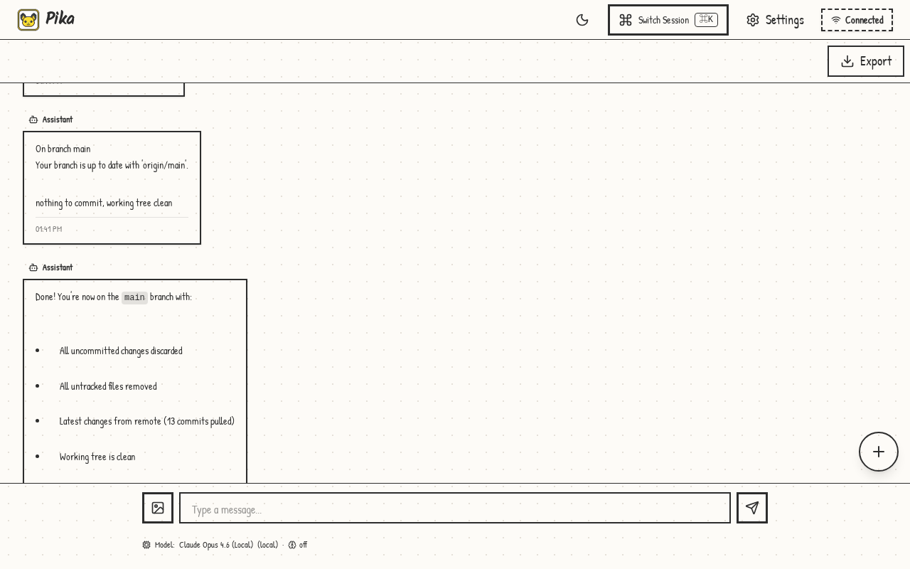
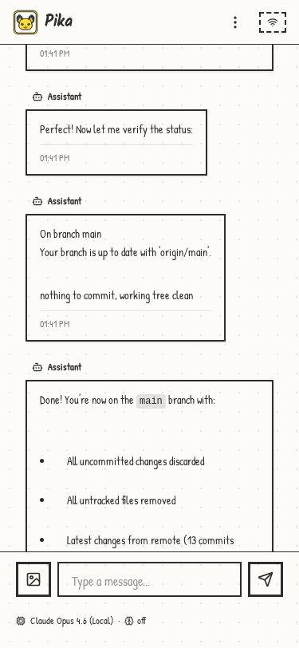

# Pika

<div align="center">
  
</div>

<div align="center">
  
  
</div>

Pika is your cute AI Coding Companion — a self-hosted web application for managing multiple [Pika](https://github.com/lsj5031/pika) coding agent sessions across projects. Pika is built on top of the [Pi](https://github.com/badlogic/pi-mono) coding agent.

Built with a **Rust (Axum)** backend and **React + TypeScript + Vite** frontend.

---

## Features

- **Session Management** — create, start, stop, and view Pika sessions
- **Project Organisation** — sessions grouped by project folder
- **Real-time Updates** — WebSocket integration for live status
- **Chat Interface** — send prompts and view full conversation history
- **Code Diff Viewer** — syntax-highlighted diffs of agent changes
- **Thinking Indicator** — real-time AI thinking state visualisation
- **Authentication** — signed HttpOnly session cookies after env-backed login
- **Mobile Responsive** — works on phones and tablets

---

## Tech Stack

**Backend:**
- Rust 2024 edition · Axum · Tokio · Tower HTTP

**Frontend:**
- React 19 · TypeScript 5 · Vite 7 · Tailwind CSS v4
- shadcn/ui · React Query · Zustand · Sonner

---

## Getting Started

### Prerequisites

- Rust (edition 2024)
- Node.js 18+ and npm
- `npx` (for running Pika CLI)

### Development

```bash
# Backend (port 7847)
cargo run

# Frontend dev server (port 5173)
cd frontend-web && npm install && npm run dev
```

Set up the frontend environment:

```bash
cp frontend-web/.env.example frontend-web/.env
# Edit VITE_API_URL and VITE_WS_URL if needed
```

### Production Build

```bash
make build          # builds frontend then backend
make run            # build + start production server
```

---

## Configuration

### Backend (`config.toml`)

Copy the example and edit:

```bash
cp config.toml.example config.toml
```

See `config.toml.example` for all available options.

### Backend Environment (auth + security)

Set in your environment or `/etc/pika/pika.env`:

```bash
AUTH_USERNAME=your-user
AUTH_PASSWORD=your-password
AUTH_SESSION_SECRET=32+bytes-random-secret
BIND_ADDRESS=127.0.0.1

# Optional
CORS_ALLOWED_ORIGINS=https://your-domain.example
TRUSTED_PROXY_CIDRS=127.0.0.1/32
ALLOW_INSECURE_REMOTE=false
ALLOWED_PROJECT_ROOTS=/srv/projects:/opt/work
PIKA_NPX_PATH=/home/your-user/.nvm/versions/node/v22.x.x/bin/npx
```

**Notes:**
- Credentials are environment-only (not read from `config.toml`).
- Protected API/WS routes require a valid signed session cookie.
- Session cookies default to `Secure=true`; set `session_cookie_secure=false` only for local HTTP dev.
- `AUTH_SESSION_SECRET` must be at least 32 bytes.
- Default bind is localhost; remote bind without auth is blocked unless explicitly overridden.

---

## Deployment

### Quick Deploy

```bash
make deploy        # Build, stage runtime, install + start services (requires sudo)
make deploy-user   # Same but with user-level systemd services (no sudo)
```

See `QUICK_START.md` and `docs/DEPLOYMENT.md` for full details.

### Makefile Targets

```bash
make build               # Build frontend + backend
make frontend            # Build frontend only
make backend             # Build backend only
make dev-frontend        # Start frontend dev server
make dev-backend         # Start backend dev server
make run                 # Build and run production server
make clean               # Clean all build artifacts
make deploy              # Deploy to production (requires sudo)
make deploy-user         # Deploy with user systemd services (no sudo)
make stage-runtime       # Stage runtime files under /opt/pika + /etc/pika
make install-service     # Install systemd services
make install-service-user # Install user systemd services (no sudo)
make restart-service     # Restart services
make restart-service-user # Restart user services (no sudo)
make status              # Check system service status
make status-user         # Check user service status
make help                # Show all available targets
```

---

## Testing

```bash
# Rust unit/integration tests
cargo test

# Frontend unit tests
cd frontend-web && npm test

# Frontend lint
cd frontend-web && npm run lint

# E2E tests (requires backend running on :7847)
make dev-backend
cd frontend-web && npm run test:e2e
```

---

## Project Structure

```
pika/
├── src/                    # Rust backend source
│   ├── main.rs            # Server entry point
│   ├── api.rs             # REST API routes
│   ├── websocket.rs       # WebSocket handler
│   ├── auth.rs            # Authentication
│   ├── config.rs          # Configuration loading
│   ├── agent.rs           # ProcessManager (spawns Pika CLI)
│   ├── sessions.rs        # Session index + persistence
│   └── ...
├── frontend-web/          # React frontend
│   ├── src/
│   │   ├── components/    # React components
│   │   ├── hooks/         # Custom React hooks
│   │   ├── lib/           # API client, toasts
│   │   ├── store/         # Zustand state stores
│   │   └── types/         # TypeScript types
│   └── package.json
├── docs/                  # Documentation
├── deploy/                # Deployment scripts and service files
├── Cargo.toml
├── Makefile
├── config.toml.example    # Backend configuration template
└── README.md
```

---

## License

MIT
